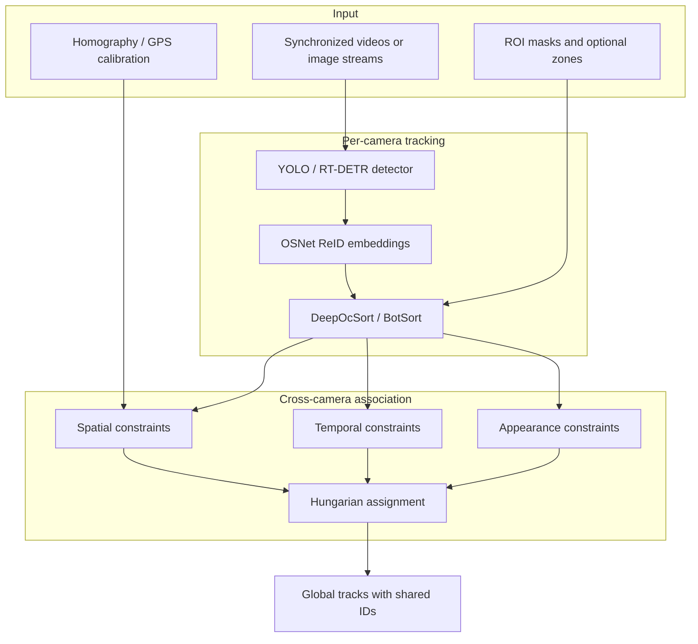
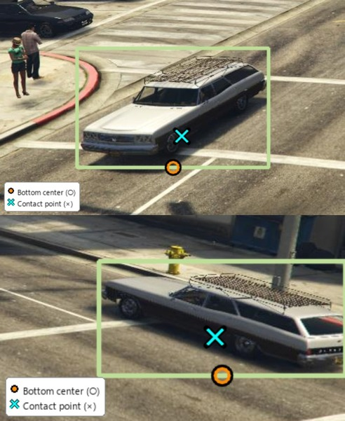
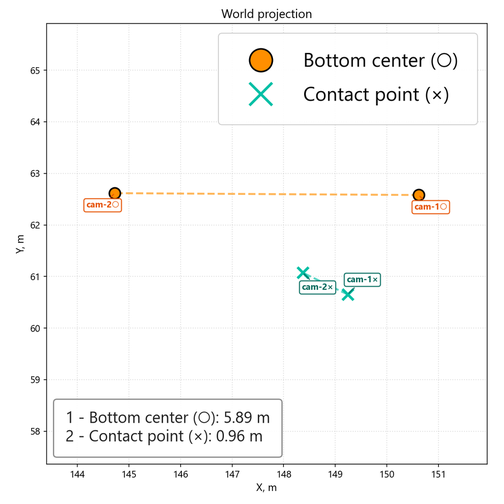
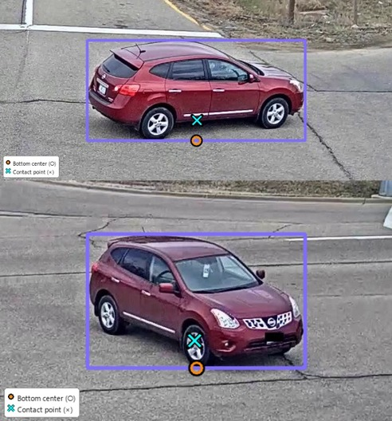
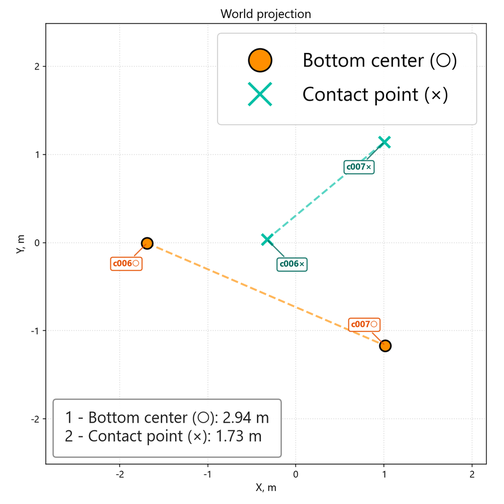

# Multi-Camera Vehicle Tracking

Multi-camera multi-target tracking (MCMT) system for vehicles. The pipeline assigns a single global ID to the same vehicle across synchronized cameras by combining appearance, geometric, spatial, and temporal constraints.

The project is built around two stages:

1. **Single-camera tracking (SCT)**: YOLO / RT-DETR detections are tracked independently per camera with DeepOcSort or BotSort and ReID embeddings.
2. **Cross-camera association (MCMT)**: local tracklets are merged into global IDs using a cost matrix and Hungarian assignment with homography / GPS geometry, temporal gates, ReID appearance, and optional zone transitions.

## GTA MCMT Clip

The short clip below shows two GTA cameras stacked vertically from the **BotSort best** run (`configs/best/gta_mcmt_best_botsort.yaml`, 56.6% MCMT). Each vehicle gets a distinct color from its global ID. The preview is a **7 s, 30 fps** GIF; for best quality use the MP4 below.

<p align="center">
  
</p>

The higher-quality MP4 (30 fps, 7 s) is available at `docs/assets/readme/mcmt_gta_clip.mp4`.

## Architecture



## Highlights

- Multi-camera tracking with global IDs across 4-camera GTA MCMT and CityFlow S02 scenes.
- Geometry-aware association using image-to-world projection, GPS tiers, and contact-point geometry.
- Temporal gating for cross-camera handoff, including penalty-only modes for difficult CityFlow transitions.
- Vehicle ReID fine-tuning and ablation configs for detector, ReID, geometry, temporal windows, and tracker variants.
- Reproducible configs under `configs/`.

## Demos

### Contact Point Geometry

The contact-point model predicts where the vehicle touches the road plane. On GTA, this substantially reduces cross-camera reprojection error compared with the raw bounding-box bottom center.

<p align="center">
  
</p>

<p align="center">
  
</p>

For the exported GTA sample, the average cross-camera distance drops from **4.44 m** with bottom-center projection to **1.63 m** with contact-point projection, a **63.2%** reduction across the scanned pairs.

The same visualization can be rendered on CityFlow S02. The current contact-point model is trained on GTA, so CityFlow is a zero-shot transfer case and is included as a diagnostic rather than a claimed improvement.

<p align="center">
  
</p>

<p align="center">
  
</p>

## Best Configs

The best configs are selected by maximum MCMT IDF1 on the concatenated multi-camera evaluation stream.

### GTA

| Config | MCMT IDF1 | SCT IDF1 | Notes |
|--------|-----------|----------|-------|
| `configs/best/gta_mcmt_best_botsort.yaml` | **56.6%** | 68.5% | BotSort + IBN + contact-point |
| `configs/best/gta_mcmt_best.yaml` | 51.3% | 65.9% | DeepOcSort |

### CityFlow

| Config | MCMT IDF1 | SCT IDF1 | Notes |
|--------|-----------|----------|-------|
| `configs/best/cityflow_mcmt_best.yaml` | **56.7%** | 78.3% | yolo26m train-FT + DeepOcSort + GPS 14/38 + temporal N=100 |
| `configs/best/cityflow_mcmt_best_yolo26l.yaml` | 33.3% | 47.5% | archive |

CityFlow component ablation: ReID-only 30.2% → +geo 54.6% → +temporal N=100 **56.7%**.

## Repository Layout

```text
core/                 Tracking, ReID, geometry, IO, visualization
configs/
  best/               Post-ablation winner configs
  gta/                GTA ablation configs
  cityflow/           CityFlow ablation configs
  train/              ReID and contact-point training configs
scripts/              Eval, data prep, setup
zones/                Portable zone polygons and cross-camera transitions
docs/assets/readme/   Curated README images and clips
```

Large datasets, model weights, experiment outputs, and local tests are intentionally kept out of git.

## Quick Start

Create the environment on Windows PowerShell:

```powershell
Set-ExecutionPolicy -Scope Process -ExecutionPolicy Bypass
.\scripts\setup_venv.ps1
.\.venv\Scripts\Activate.ps1
```

Run a best GTA config:

```powershell
python run.py --config configs/best/gta_mcmt_best_botsort.yaml
```

Run a best CityFlow S02 config:

```powershell
python run.py --config configs/best/cityflow_mcmt_best.yaml
```

Evaluate after a run:

```powershell
python scripts/eval_gta_mcmt.py --gt-root datasets/gta_mcmt --pred-dir outputs/best_configs/gta_mcmt_best_botsort/per_cam --cameras 0 1 2 3 --max-iou-dist 0.7 --apply-roi --align-pred-frames

python scripts/eval_s02.py --cityflow-protocol --gt-root datasets/AICity22_Track1_MTMC_Tracking/validation/S02 --pred-dir outputs/best_configs/cityflow_mcmt_best/per_cam
```

## Data and Weights

The repository does not include datasets or heavy model weights.

| Artifact | Local path | Notes |
|----------|------------|-------|
| GTA MCMT images | `datasets/gta_mcmt/` | Download separately. |
| GTA contact-point labels | `datasets/gta_mcmt_with_points/` | Used for contact-point training. |
| CityFlow S02 videos | `datasets/validation/S02/` | From AICity / CityFlow. |
| YOLO weights | `models/` or working directory | Ultralytics can download generic weights automatically. |
| Vehicle ReID weights | `runs/vehicle_reid/...` | Produced by `train_vehicle_reid.py`. |
| Contact-point weights | `runs/contact_point/...` | Produced by `train_contact_point.py`. |

Small CityFlow metadata files used for synchronization are kept under `datasets/AICity22_Track1_MTMC_Tracking/`.

## Datasets Used

If you use this repository or reproduce the experiments, please cite the original datasets used for training and evaluation:

| Dataset | Used for | Notes |
|---------|----------|-------|
| [GTA MCMT / MC-GTA](https://github.com/schuar-iosb/mc-gta) | Synthetic MCMT evaluation, geometry ablations, contact-point training data | Multi-camera vehicle tracking data exported from GTA V with camera calibration and synchronized views. |
| [AI City Challenge / CityFlow](https://www.aicitychallenge.org/) | Real-world MCMT evaluation on CityFlow S02 | Urban multi-camera vehicle tracking benchmark with ROI masks, calibration, timestamps, and MOT-style annotations. |
| [VeRi-776](https://vehiclereid.github.io/VeRi/) | Vehicle ReID training | Vehicle re-identification dataset with cross-camera IDs and viewpoints. |
| [VRIC](https://qmul-vric.github.io/) | Vehicle ReID training | Vehicle ReID dataset used together with VeRi for domain-specific OSNet training. |
| [VeRI-Wild](https://github.com/PKU-IMRE/VERI-Wild) | Large-scale vehicle ReID fine-tuning | Wild large-scale vehicle ReID data; the downstream experiments use the `epoch_120` checkpoint trained with the expanded ReID set. |

The repository only stores lightweight configs and metadata. Dataset images, videos, labels, and trained weights must be downloaded or generated separately according to the licenses of the original datasets.
